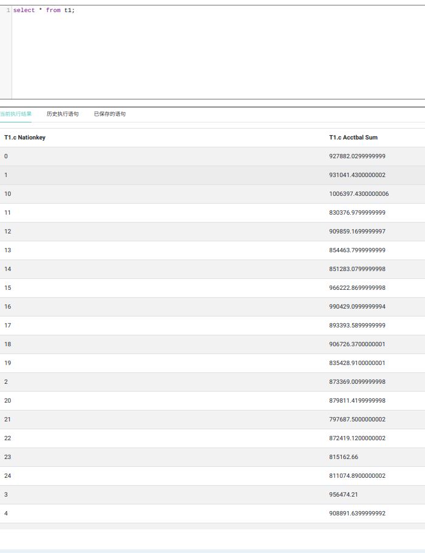
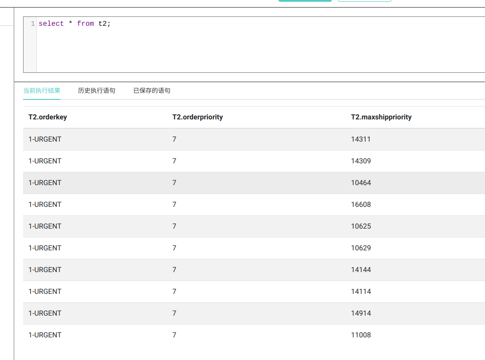

# MPLab3

## 小组成员：

201830059 陈思睿 1310459235@qq.com


201220098 杨林 1479016371@qq.com


201830122 邹忠奇 617397223@qq.com

## Task1: Nation

`KEYOUT=Text, VALUEOUT=DoubleWritable`

### Map

使用`value.toString().split("\\|")` 将.tbl文件中的每个元素分开，取出`c_nationkey` 项和`c_acctbal`项（并转换为`DoubleWritable`），存入`context`中。

**code:**

```java
public static class Map extends Mapper<Object, Text, Text, DoubleWritable> {
    @Override
    public void map(Object key, Text value, Context context) throws IOException, InterruptedException {
        String[] info=value.toString().split("\\|");
        Text nation = new Text(info[3]);
        DoubleWritable balance = new DoubleWritable(Double.parseDouble(info[5]));
        context.write(nation,balance);
    }
}
```

### Reduce

`for`循环求和`values`，写入`context`。

**code:**

```java
public static class Reduce extends Reducer<Text, DoubleWritable, Text, DoubleWritable> {
    @Override
    public void reduce(Text key, Iterable<DoubleWritable> values, Context context) throws IOException, InterruptedException {
       double ans=0.0;
       for(DoubleWritable dw:values){
           ans+=dw.get();
       }
       context.write(key,new DoubleWritable(ans));
    }
}
```

### Hive create table

输出文件在`/user/2023fg08/lab3/output1/`中

```sql
create table t1 (c_nationkey string, c_acctbal_sum string) row format delimited fields terminated by '\t' location '/user/2023fg08/lab3/output1/';
```

### Result



## Task2

`KEYOUT=Text, VALUEOUT=Text`

### Map

使用`value.toString().split("\\|")` 将.tbl文件中的每个元素分开，取出`order_key, order_priority` 和`ship_priority`项，以`order_priority`为`Key`， `ship_priority + "\t" + order_key`为`Value`写入`context`。

**code:**

```java
public static class Map extends Mapper<Object, Text, Text, Text> {

    @Override
    public void map(Object key, Text value, Context context) throws IOException, InterruptedException {
        String[] info=value.toString().split("\\|");
        String orderKey=info[0];
        Text orderPriority=new Text(info[5]);
        String shipPriority=info[7];
        Text msg= new Text(shipPriority+"\t"+orderKey);
        context.write(orderPriority,msg);
    }
}
```

### Reduce

for循环遍历values，找到`ship_priority`的最大值，将`ship_priority`最大的`Text`存入`ArrayList`，写入`context`。

**code:**

```java
public static class Reduce extends Reducer<Text, Text, Text, Text> {
    @Override
    public void reduce(Text key, Iterable<Text> values, Context context) throws IOException, InterruptedException {
        int maxShip=-99999;
        ArrayList<Text> maxList=new ArrayList<>();
        for(Text v : values){
            String[] s=v.toString().split("\t");
            int shipPriority=Integer.parseInt(s[0]);
            if(shipPriority>maxShip){
                maxShip=shipPriority;
                maxList.clear();
                maxList.add(new Text(v));
            }
            else if(shipPriority==maxShip){
                maxList.add(new Text(v));
            }
        }
        for(Text o:maxList){
            context.write(key,o);
        }
    }
}
```

### Hive Result:



## WebUI


Task1:1185

Task2:1191
